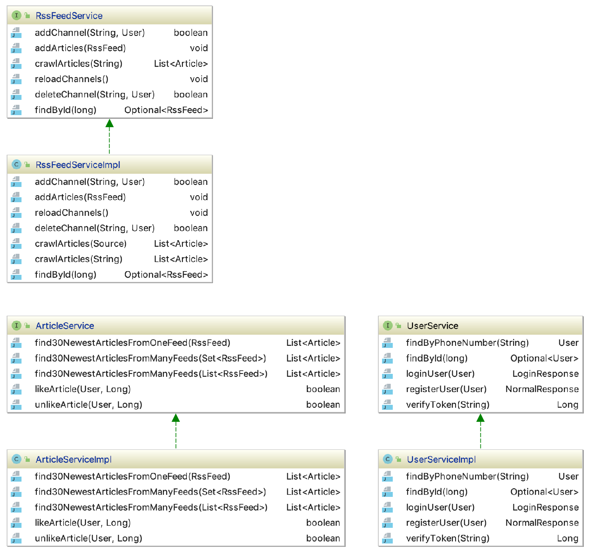
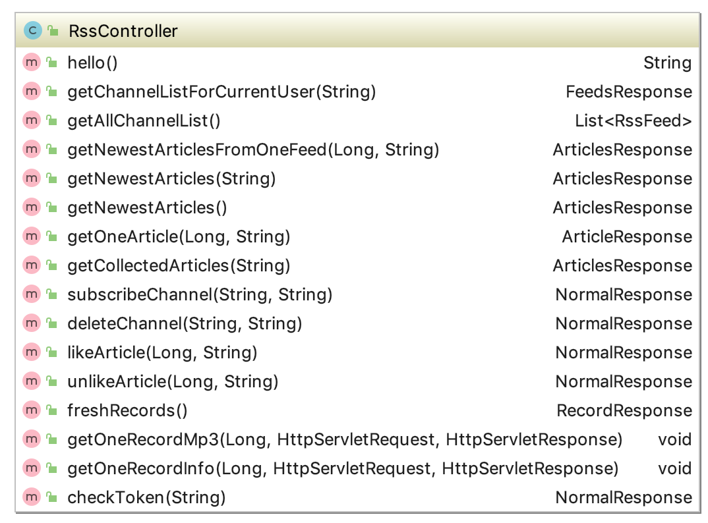

# IcecreamServer
## Overview

It uses Spring Boot framework to realize HTTP connection and database connection.

## API list

### login
POST
URL example: `http://server_ip/signin`

| Name | Type | Description |
| - | - | - |
| User | parameter | necessary |
| status | return | 0 "can't find phone number" |
| status | return | 1 "wrong password" |
| status | return | 2 "login succeed" |

### register
POST
URL example: `http://server_ip/signup`

| Name | Type | Description |
| - | - | - |
| user | parameter | necessary |
| status    | return | 0 "register succeed" |

### verify if phone number exists
POST
URL example: `http://server_ip/before-register`

| Name | Type | Description |
| - | - | - |
| user | parameter | necessary |
| status    | return |0 "phone number is null" |
| status    | return |1 "phone number already exists" |
| status    | return |2 "phone number doesn't exist" |

### list user-collected channels
GET
URL example: `http://server_ip/list/feeds`

| Name | Type | Description |
| - | - | - |
| token | parameter | check the user |
| status    | return |0 "wrong token" |
| status    | return |1 "user not find" |
| status    | return |2 "succeed" |

### list all channels
GET
URL example: `http://server_ip/list/all/feeds`

| Name | Type | Description |
| - | - | - |
| List<RssFeed>    | return |list of rssfeed |

### articles for a subscribed channel
GET
URL example: `http://server_ip/list/feed/{id}/articles`

| Name | Type | Description |
| - | - | - |
| token | parameter | check the user |
| id | parameter | channel id |
| status    | return |0 "wrong token" |
| status    | return |1 "user not find" |
| status    | return |2 "feed not find" |
| status    | return |3 "succeed" |

### articles for all subscribed channels
GET
URL example: `http://server_ip/list/user/all/articles`

| Name | Type | Description |
| - | - | - |
| token | parameter | check the user |
| status    | return |0 "wrong token" |
| status    | return |1 "user not find" |
| status    | return |2 "succeed" |

### articles for all channels
GET
URL example: `http://server_ip/list/feed/all/articles`

| Name | Type | Description |
| - | - | - |
| status    | return | ArticlesResponse |

### article for a given article id
GET
URL example: `http://server_ip/list/article/{id}`

| Name | Type | Description |
| - | - | - |
| token | parameter | check the user |
| id | parameter | article id |
| status    | return |0 "wrong token" |
| status    | return |1 "article not find" |
| status    | return |2 "article find succeed" |

### subscribe a new channel
GET
URL example: `http://server_ip/addChannel`

| Name | Type | Description |
| - | - | - |
| token | parameter | check the user |
| url | parameter | url of the channel |
| status    | return |0 "wrong token" |
| status    | return |1 "user not find" |
| status    | return |2 "add failed" |
| status    | return |3 "add succeed" |

### unsubscribe a channel
GET
URL example: `http://server_ip/deleteChannel/`

| Name | Type | Description |
| - | - | - |
| token  | parameter | check the user     |
| url    | parameter | url of the channel |
| status    | return |0 "wrong token" |
| status | return    | 1 "user not find"  |
| status    | return |2 "delete failed" |
| status    | return |2 "delete succeed" |

### collected articles
GET
URL example: `http://server_ip/list/like/articles/`

| Name | Type | Description |
| - | - | - |
| token  | parameter | check the user     |
| status    | return |0 "wrong token" |
| status | return    | 1 "user not find"  |
| status    | return |2 "succeed" |

### collect an article
GET
URL example: `http://server_ip/like/article/{id}`

| Name | Type | Description |
| - | - | - |
| token | parameter | check the user |
| id | parameter | article id |
| status    | return |0 "wrong token" |
| status    | return |1 "user not find" |
| status    | return |2 "succeed" |

### uncollect an article
GET
URL example: `http://server_ip/unlike/article/{id}`

| Name | Type | Description |
| - | - | - |
| token | parameter | check the user |
| id | parameter | article id |
| status    | return |0 "wrong token" |
| status    | return |1 "user not find" |
| status    | return |2 "succeed" |

### fresh the sound of article
GET
URL example: `http://server_ip/freshRecords`

| Name | Type | Description |
| - | - | - |
| status    | return |0  "succeed" |

### get the record mp3 of an article
GET
URL example: `http://server_ip/list/record_mp3/{id}`

| Name | Type | Description |
| - | - | - |
| response | parameter | HttpServletResponse  |
| id | parameter | article id |

### get the record info of an article
GET
URL example: `http://server_ip/list/record_info/{id}`

| Name | Type | Description |
| - | - | - |
| response | parameter | HttpServletResponse  |
| id | parameter | article id |

### check the token
GET
URL example: `http://server_ip/checkToken`

| Name | Type | Description |
| - | - | - |
| token | parameter | check the user |
| status    | return |0 "wrong token" |
| status    | return |1 "user not find" |
| status    | return |2 "valid" |

## classes
### entity

### dao

### service

### controller

### response

### configure 

## Tests
inside `test/com/icecream/server/controller`
I write tests for each public method in UserServiceImpl, RssFeedServiceImpl
ArticleServiceImpl, UserController, RssController and JwtTokenProvider.
Since methods in rss folder is from open source, which is used to parse rss source,
so I don't write tests for code in it.

## Next plans
* [X] Use token to keep login state
* [X] Design api returns in a systematic way (maybe use a Json format)
* [X] Use post and encryption to increase security
* [X] Write junit test for rss part
* [X] Some weird logic about update a channel and subscirbe channel
  * determine if the sources are given by the app and user can't add a customized rss feed

* [X] Make crawling articles an automatic task
* [X] MP3 record storage / reading handling
* [ ] Classify the channels 